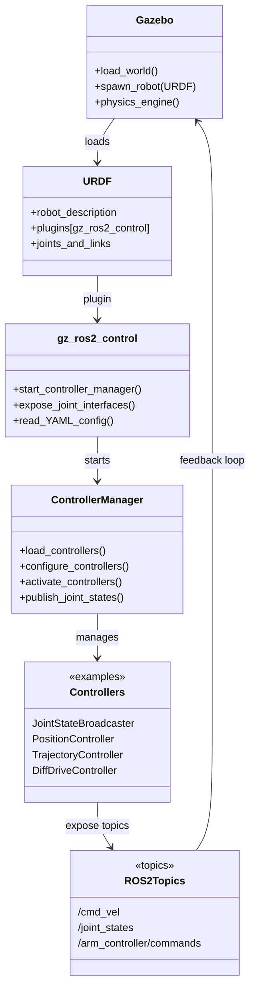
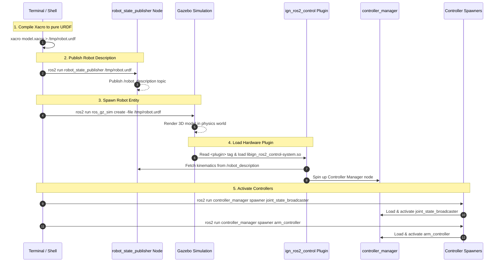

# Installation

```bash
sudo apt update && sudo apt upgrade -y
sudo apt install -y build - essential cmake git wget curl gnupg lsb - release
sudo apt install -y gazebo
sudo apt install -y \
  ros - humble - ros - gz \
  ros - humble - ros - gz - sim \
  ros - humble - ros - gz - bridge \
  ros - humble - ros - gz - image \
  ros - humble - ros - gz - interfaces \
  ros - humble - gz - ros2 - control
```

# Check Gazebo Version and the pkg

```bash
ign gazebo -- version
```
This prints the installed Fortress version.
```bash
dpkg -l | grep ros-humble-ros-gz

```

The shell log confirms that all required ROS 2 Gazebo integration packages (ros-humble-ros-gz, ros-humble-ros-gz-sim, ros-humble-ros-gz-bridge, ros-humble-ros-gz-image, ros-humble-ros-gz-interfaces, and ros-humble-ros-gz-sim-demos) are installed successfully.

```bash
dpkg -l | grep ros-humble-ros-gz
ii  ros-humble-ros-gz                                  0.244.24-1jammy.20260422.111412                  amd64        Meta-package containing interfaces for using ROS 2 with Gazebo simulation.
ii  ros-humble-ros-gz-bridge                           0.244.24-1jammy.20260422.064121                  amd64        Bridge communication between ROS and Gazebo Transport
ii  ros-humble-ros-gz-image                            0.244.24-1jammy.20260422.073210                  amd64        Image utilities for Gazebo simulation with ROS.
ii  ros-humble-ros-gz-interfaces                       0.244.24-1jammy.20260414.035014                  amd64        Message and service data structures for interacting with Gazebo from ROS2.
ii  ros-humble-ros-gz-sim                              0.244.24-1jammy.20260422.085839                  amd64        Tools for using Gazebo Sim simulation with ROS.
ii  ros-humble-ros-gz-sim-demos                        0.244.25-1jammy.20260612.213907                  amd64        Demos using Gazebo Sim simulation with ROS
```
# Test Gazebo GUI

```bash
ign gazebo -r -v 4 sensors . sdf
```
# Gazebo Simulation Workflow

📑 Detailed Step-by-Step Breakdown

The diagram below illustrates how a URDF robot model is compiled, spawned, and hooked up to `ros2_control` inside Gazebo.


Adding these export commands to my ~/.bashrc file, I permanently set environment variables that tell the shell where to find ROS 2 libraries, Gazebo plugins, and my robot’s meshes, so every new terminal session automatically has the correct paths configured.

```bash
gedit ~/.bashrc
```
I add these commands to my ~/.bashrc file
```bash
source /opt/ros/humble/setup.bash
export IGN_GAZEBO_RESOURCE_PATH=~/sim_ws/install/fairino_description/share:$IGN_GAZEBO_RESOURCE_PATH
export GAZEBO_PLUGIN_PATH=$GAZEBO_PLUGIN_PATH:/opt/ros/humble/lib
export PATH=$PATH:$HOME/.local/bin
export IGN_GAZEBO_SYSTEM_PLUGIN_PATH=/opt/ros/humble/lib:$IGN_GAZEBO_SYSTEM_PLUGIN_PATH
export GZ_SIM_SYSTEM_PLUGIN_PATH=/opt/ros/humble/lib:$GZ_SIM_SYSTEM_PLUGIN_PATH
export IGN_GAZEBO_RESOURCE_PATH=$HOME/sim_ws/install/fairino_description/share/fairino_description/config:$IGN_GAZEBO_RESOURCE_PATH
```
so that the environment variables are set automatically, and each time I open a new terminal I run 
```bash 
source ~/.bashrc 
```
to apply them.

1️⃣ Xacro Compilation
Command: xacro robot.xacro > /tmp/robot.urdf

What happens: Gazebo cannot parse Xacro macros, variables, or conditional tags directly. This step flattens the .xacro file tree into a plain XML URDF file (/tmp/robot.urdf).

2️⃣ Publishing Robot Description (robot_state_publisher)

Command: ros2 run robot_state_publisher robot_state_publisher /tmp/robot.urdf

What happens:

Reads /tmp/robot.urdf and broadcasts it over the ROS 2 network on the /robot_description topic and parameter server.

Why it is required: The Gazebo control plugin needs to query this node to parse joint limits, kinematics, and hardware interfaces. Without it, the plugin hangs waiting for /robot_description.

3️⃣ Spawning Entity in Gazebo (ros_gz_sim create)

Command: ros2 run ros_gz_sim create -file /tmp/robot.urdf -name robot_name

What happens:

Acts as a bridge client calling Gazebo's entity creation service.

Tells Gazebo to instantiate the visual and collision geometry inside the running 3D world (empty.sdf).

4️⃣ Loading ign_ros2_control Plugin

What happens:

Once the entity is spawned, Gazebo parses the <gazebo> tag inside the URDF and dynamically loads libign_ros2_control-system.so.

The plugin connects to robot_state_publisher, maps the URDF joint names to Gazebo simulated actuators, and initializes the ROS 2 Controller Manager (/controller_manager).

5️⃣ Spawning & Activating Controllers

Commands:

ros2 run controller_manager spawner joint_state_broadcaster

ros2 run controller_manager spawner left_arm_controller

What happens:

Calls the /controller_manager/load_controller and switch_controller services.

joint_state_broadcaster: Reads joint angles from Gazebo physics and publishes them to ROS 2 (/joint_states).

arm_controller: Accepts joint trajectories (e.g., from MoveIt) and writes joint commands directly to the simulated motors in Gazebo.
Terminal1:
```bash
source ~/.bashrc
ign gazebo -r empty.sdf
```

Terminal2:
```bash
source ~/sim_ws/install/setup.bash
xacro ~/sim_ws/src/fairino_description/urdf_dual_arms/fairino3_dual_arms.urdf.xacro > /tmp/fairino.urdf
ros2 run robot_state_publisher robot_state_publisher /tmp/fairino.urdf
```

Terminal3:
```bash
source ~/sim_ws/install/setup.bash

ros2 run ros_gz_sim create -file /tmp/fairino.urdf -name fairino_dual_arms -x 0.0 -y 0.0 -z 0.0
ros2 run controller_manager spawner joint_state_broadcaster
ros2 run controller_manager spawner left_arm_controller
ros2 run controller_manager spawner right_arm_controller
```
Note: Use this command to directly launch a complete SDF World in Ignition/Gazebo Sim.(Unlike model spawning, this opens the full simulation environment directly from the SDF world file.)
Parameters:
-r: Starts the simulation immediately (Run mode, auto-play without pressing Play button)
// $HOME/...   : Absolute path to your custom world.sdf file

```bash
ros2 run ros_gz_sim create -file /path/to/your_model.sdf -name my_model -x 0.0 -y 0.0 -z 0.0
```
Terminal4:
```bash
ros2 control list_controllers
```

Gazebo loads the world and spawns the robot from its URDF.

The URDF includes the gz_ros2_control plugin, which connects Gazebo’s physics engine to ROS 2.

The gz_ros2_control plugin starts the controller manager and exposes joint interfaces.

The Controller Manager reads the YAML config, loads, configures, and activates controllers.

Controllers (e.g. JointStateBroadcaster, PositionController, TrajectoryController) expose ROS 2 topics.

ROS 2 Topics (/cmd_vel, /joint_states, /arm_controller/commands) allow you to send commands and receive feedback.

The loop closes as Gazebo applies commands and publishes joint states back.

🔎 Bridge Testing

ign topic -e -t /chatter 
Shows messages published inside Gazebo’s Ignition Transport layer.
Useful to confirm Gazebo is producing data.

ros2 topic echo /chatter  
Shows messages on the ROS 2 DDS layer.
Useful to confirm the bridge forwards Ignition messages into ROS 2.

Difference:
    ign topic -e -t /chatter → Gazebo side.
    ros2 topic echo /chatter → ROS 2 side.
    Seeing the same message on both confirms the bridge is functional.

ign topic -l  
Lists all active Ignition Transport topics inside Gazebo.
Useful for discovering what Gazebo is publishing.

ros2 topic list  
Lists all active ROS 2 topics.
Useful for discovering what ROS 2 nodes are publishing/subscribing.

⚙️ Controller Integration

The gz_ros2_control plugin is added to the URDF.

It loads a YAML configuration file (rrbot_controllers.yaml) that defines:

joint_state_broadcaster (publishes joint states).

_arm_controller (controls joints defined in URDF).

When Gazebo spawns the robot, the plugin starts a controller manager.

The controller manager reads joints from the URDF and exposes them as ROS 2 interfaces.

🚀 Launch File Workflow

A launch file is used to run multiple nodes at once:

Gazebo simulation (spawns RRBot).

ros_gz_bridge (connects Ignition ↔ ROS 2 topics).

controller_manager (loads controllers from YAML).

This ensures the entire pipeline starts with a single command.


✅ State Flow Summary

Gazebo loads RRBot with the gz_ros2_control plugin.

Controller Manager reads joints from URDF and YAML.

Controllers expose ROS 2 topics (/cmd_vel, /joint_states).

Bridge connects Ignition topics ↔ ROS 2 topics.

Tests:

ign topic -e -t /chatter ↔ ros2 topic echo /chatter → confirms bridge.
ign topic -l ↔ ros2 topic list → shows available topics.
ros2 control list_controllers → shows active controllers.
ros2 topic pub /cmd_vel ... → moves the robot in Gazebo.

# Bridge Verification

4.1. Run the Bridge
```bash
ros2 run ros_gz_bridge parameter_bridge / chatter@std_msgs / msg /
String@ignition . msgs . StringMsg
```
4.2. Publish a ROS 2 Message
```bash
ros2 topic pub / chatter std_msgs / msg / String "data:’Hello Gazebo Ignition’"
-- once
```

4.3. Echo the Topic
• ROS 2 side:
```bash
ros2 topic echo / chatter
```
Shows payloads in ROS 2 DDS.

• Gazebo side:
```bash
ign topic -e -t / chatter
```
Shows payloads in Gazebo Transport.

# Controllers verification 
1.run gazebo launch
```bash
ros2 launch fairino_description gazebo.launch.py 
```
this what shell log 

```bash
[ign gazebo-1] [INFO] [1785315557.832028303] [gz_ros2_control]: Loading controller_manager
[ign gazebo-1] [INFO] [1785315558.033447816] [controller_manager]: Loading controller 'left_arm_controller'
[spawner-6] [INFO] [1785315558.046366343] [spawner_left_arm_controller]: Loaded left_arm_controller
[ign gazebo-1] [INFO] [1785315558.047178939] [controller_manager]: Loading controller 'right_arm_controller'
[ign gazebo-1] [INFO] [1785315558.052485529] [controller_manager]: Loading controller 'joint_state_broadcaster'
[spawner-7] [INFO] [1785315558.053656608] [spawner_right_arm_controller]: Loaded right_arm_controller
[ign gazebo-1] [INFO] [1785315558.071350045] [controller_manager]: Configuring controller 'left_arm_controller'
[spawner-5] [INFO] [1785315558.072402989] [spawner_joint_state_broadcaster]: Loaded joint_state_broadcaster
[ign gazebo-1] [INFO] [1785315558.073141882] [left_arm_controller]: configure successful
[ign gazebo-1] [INFO] [1785315558.073456857] [controller_manager]: Configuring controller 'right_arm_controller'
[ign gazebo-1] [INFO] [1785315558.074009515] [right_arm_controller]: configure successful
[ign gazebo-1] [INFO] [1785315558.074128614] [controller_manager]: Configuring controller 'joint_state_broadcaster'
[ign gazebo-1] [INFO] [1785315558.074182488] [joint_state_broadcaster]: 'joints' or 'interfaces' parameter is empty. All available state interfaces will be published
[ign gazebo-1] [WARN] [1785315558.185315798] [gz_ros2_control]:  Desired controller update period (0.01 s) is slower than the gazebo simulation period (0.001 s).
[ign gazebo-1] [INFO] [1785315558.197403486] [left_arm_controller]: activate successful
[spawner-6] [INFO] [1785315558.210264095] [spawner_left_arm_controller]: Configured and activated left_arm_controller
[ign gazebo-1] [INFO] [1785315558.224041474] [right_arm_controller]: activate successful
[spawner-7] [INFO] [1785315558.249175826] [spawner_right_arm_controller]: Configured and activated right_arm_controller
[spawner-5] [INFO] [1785315558.300156124] [spawner_joint_state_broadcaster]: Configured and activated joint_state_broadcaster
[INFO] [spawner-6]: process has finished cleanly [pid 10869]
[INFO] [spawner-7]: process has finished cleanly [pid 10871]
[INFO] [spawner-5]: process has finished cleanly [pid 10867]
```

When launching with a controller‑enabled description, the log shows:

Controller manager is loaded.

Controllers (left_arm_controller, right_arm_controller, joint_state_broadcaster) are loaded, configured, and activated.

Warnings may appear if the desired update period is slower than Gazebo’s simulation period, but controllers still activate successfully.

Each spawner process reports clean completion once controllers are active.

2.joint states
To verify that joint states are being published:
```bash
ros2 topic echo \joint_states
```
This displays the current positions, velocities, and efforts for all joints in both arms. The output confirms that the joint_state_broadcaster is active and publishing data from Gazebo into ROS 2. 

```bash
---
header:
  stamp:
    sec: 180
    nanosec: 800000000
  frame_id: base_link
name:
- left_joint5
- left_joint4
- left_joint6
- right_joint1
- right_joint2
- right_joint3
- right_joint4
- left_joint1
- left_joint2
- left_joint3
- right_joint5
- right_joint6
position:
- 1.0277304319816621e-16
- 2.7273592117631175e-15
- -9.39723889476036e-14
- -1.964762640319587e-19
- 3.443290829930981e-12
- 7.777454721307638e-12
- 2.5989535628814997e-15
- 1.7069704063053744e-19
- -3.4431828682197297e-12
- -7.77683095641712e-12
- -3.3140714780004693e-18
- -9.39743041383492e-14
velocity:
- -4.686209780684417e-19
- 6.938893903907228e-18
- 6.579751934271405e-18
- -1.1092425839887097e-18
- -3.387284756069947e-18
- 6.938893903907228e-18
- -6.938893903907228e-18
- -3.848176558494693e-19
- -1.1750464560785281e-18
- 0.0
- -5.250651360911001e-18
- 9.595189226496714e-18
effort:
- -4.6018576079113795e-06
- -0.000404979431802205
- 0.0003991103864256372
- 2.1708130949147633e-15
- -12.92974941867607
- -12.929997133461272
- -0.0003861092013439923
- 2.3843077175064742e-14
- 12.92945375858337
- 12.929206043639704
- -1.4275046022152795e-09
- 0.0003991111181387646
```
3. Send Position Commands
With the controllers active, you can send position commands directly to the arms.

    Left Arm Controller  
    Publish a Float64MultiArray with six values (one per joint):
```bash
ros2 topic pub /left_arm_controller/commands std_msgs/msg/Float64MultiArray "{
  data: [0.0, -1.57, 1.57, 0.0, 0.5, -0.5]
}" --once
```
This command sets the six joints of the left arm to the specified positions in radians. The controller applies them immediately, and the updated positions can be observed on /joint_states.

```bash
header:
  stamp:
    sec: 538
    nanosec: 810000000
  frame_id: base_link
name:
- left_joint5
- left_joint4
- left_joint6
- right_joint1
- right_joint2
- right_joint3
- right_joint4
- left_joint1
- left_joint2
- left_joint3
- right_joint5
- right_joint6
position:
- 0.5000000001160025
- -0.0028827798747943886
- -0.5000000000000944
- -1.9094603885889098e-19
- 3.4432908429783074e-12
- 7.777454721316434e-12
- 2.5989188684033493e-15
- -1.13287901811063e-12
- -1.56655469808294
- 1.5700000002788232
- -3.334556016917782e-18
- -9.397430569011221e-14
```
